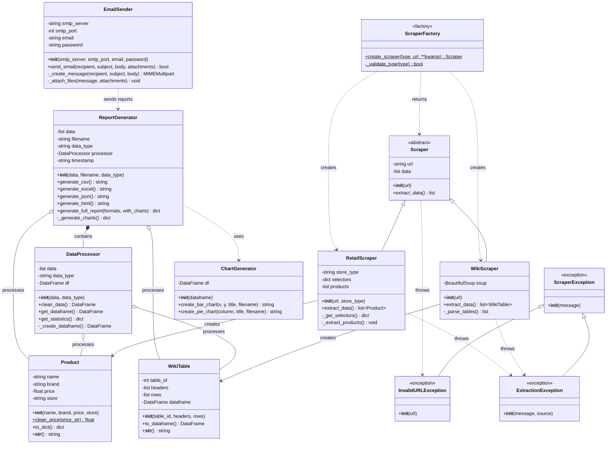

# SISTEMA DE WEB SCRAPING EN PYTHON
**Proyecto Final – Programación Orientada a Objetos – Universidad Nacional de Colombia**


**Autores:**
* Juan David Moreno Martin

* Yulieth Alexandra Morales Soler

* Roniel David Castro Navarro

# Tabla de Contenido
- [Descripción](#Descripción-general)
- [Características](#Características)
- [Herramientas](#Herramientas-usadas)
- [Instalación](#Instalación)
- [Estructura del Proyecto](#Estructura-del-Proyecto)
- [Ejemplos de Uso](#Ejemplos-de-Uso)
- [Formatos de Reporte Disponibles](#Formatos-de-Reporte-Disponibles)
- [Tipos de Gráficos](#Tipos-de-Gráficos)
- [Estadísticas Generadas](#Estadísticas-Generadas)
- [Flujo de Trabajo Típico](#Flujo-de-Trabajo-Típico)
- [Características Principales](#Características-Principales)


# Descripción general

Este proyecto implementa un sistema completo de web scraping desarrollado en python, capaz de extraer, procesar y analizar información proveniente de páginas web tanto **estaticas** como **dinámicas**.

El sistema integra herramientas modernas como `Request`, `BeautifulSoup`, `Playwright`, `Pandas`, `Matplotlib`, y librerias para generación de reportes y envio de correos.

Su objetivo es automaizar la recolección de datos, generar analisís utiles y permitir la creación de reportes y alertas personalizadas.

# Características

- **Scraping de múltiples sitios web de mercado**  
  El sistema extrae información desde varias páginas (como precios, productos, descripciones y enlaces).

- **Procesamiento y limpieza de datos**  
  Los datos recolectados se organizan, filtran y normalizan antes de generar la salida final.

- **Exportación automática de resultados**  
  Los datos pueden ser exportados en formatos como CSV o Excel.

- **Automatización completa del proceso**  
  El flujo completo —*scraping → procesamiento → exportación → envío*— se ejecuta sin intervención manual.

 # Herramientas usadas

### **Librerías**
- **Playwright (`playwright.sync_api`)**  
  Ha sido utilizada para automatizar el navegador (Chromium). Permite abrir páginas, interactuar con elementos, scrollear y extraer contenido dinámico.

- **Pandas (`pandas`)**  
  Usada para almacenar los datos recolectados en DataFrames y exportarlos como archivos CSV o Excel.

- **Time (`time`)**  
  Empleada para agregar pausas controladas (`sleep`) que aseguran que el contenido de la página cargue correctamente durante el scraping.

---

### **Conceptos de Programación**
- **Programación Orientada a Objetos (POO)**  
  El scraper está estructurado mediante clases y métodos, proporcionando modularidad y una mejor organización del código.

- **Web Scraping Dinámico**  
  Extracción de información desde páginas que cargan elementos mediante JavaScript, utilizando selectores CSS y la API de Playwright.

- **Control de Flujo**  
  Uso de ciclos y condicionales para manejar paginación, botones de “Cargar más” y lógica repetitiva del scraping.

- **Manejo de Archivos**  
  Generación de archivos CSV/XLSX con los datos obtenidos durante la ejecución.

# Instalación

### 1. Abrir el proyecto en VSCode
```bash
cd Python-Web-Scraper
```

### 2. Crear entorno virtual (Opcional)

**Windows:**
```bash
python -m venv venv
venv\Scripts\activate
```

### 3. Instalar dependencias
```bash
pip install -r requirements.txt
```

### 4. Instalar navegadores de Playwright
```bash
playwright install
# Si no funciona:
python -m playwright install
```

# Estructura del Proyecto

```
Python-Web-Scraper/
│
├── src/
│   ├── __init__.py
│   │
│   ├── models/                    # Modelos de datos
│   │   ├── __init__.py
│   │   ├── product.py            # Modelo de producto retail
│   │   └── wiki_table.py         # Modelo de tabla wiki
│   │
│   ├── scrapers/                  # Scrapers especializados
│   │   ├── __init__.py
│   │   ├── base_scraper.py       # Clase base abstracta
│   │   ├── wiki_scraper.py       # Scraper de wikis
│   │   └── retail_scraper.py     # Scraper de tiendas
│   │
│   ├── utils/                     # Utilidades
│   │   ├── __init__.py
│   │   ├── scraper_factory.py    # Factory de scrapers
│   │   ├── data_processor.py     # Procesamiento de datos
│   │   ├── report_generator.py   # Generación de reportes
│   │   ├── chart_generator.py    # Generación de gráficos
│   │   └── email_sender.py       # Envío de emails
│   │
│   └── exceptions.py              # Excepciones personalizadas
│
├── examples/                      # Ejemplos de uso
│   ├── example_wiki.py           # Ejemplo básico wiki
│   ├── example_retail.py         # Ejemplo básico retail
│   ├── example_charts.py         # Ejemplo con gráficos
│   ├── example_email.py          # Ejemplo con email
│   └── example_complete.py       # Ejemplo completo
│
└── requirements.txt               # Dependencias
```

---

# Ejemplos de Uso

### Ejemplo 1: Scraping Básico de Wiki
```bash
cd examples
python example_wiki.py
```

**Salida esperada:**
- `minecraft_brewing_YYYYMMDD_HHMMSS.csv`
- `minecraft_brewing_YYYYMMDD_HHMMSS.xlsx`

### Ejemplo 2: Scraping de Tienda (Alkosto)
```bash
cd examples
python example_retail.py
```

**Salida esperada:**
- `alkosto_products_YYYYMMDD_HHMMSS.csv`
- `alkosto_products_YYYYMMDD_HHMMSS.xlsx`

### Ejemplo 3: Reportes con Gráficos
```bash
cd examples
python example_charts.py
```

**Salida esperada:**
- Reportes CSV, Excel, HTML
- `reporte_con_graficos_precios_YYYYMMDD_HHMMSS.png`
- `reporte_con_graficos_marcas_YYYYMMDD_HHMMSS.png`

### Ejemplo 4: Envío por Email
```bash
cd examples
python example_email.py
```

### Ejemplo 5: Flujo Completo
```bash
cd examples
python example_complete.py
```

# Formatos de Reporte Disponibles

| Formato | Descripción | Uso |
|---------|-------------|-----|
| **CSV** | Archivo de valores separados por comas | Excel, análisis de datos |
| **Excel** | Archivo con múltiples hojas | Análisis |
| **HTML** | Página web con estilos | Visualización en navegador |
| **PNG** | Gráficos (barras, torta) | Presentaciones, reportes |

---

# Tipos de Gráficos

### Gráfico de Barras
- Muestra los top 15 productos más caros
- Útil para comparar precios
- Archivo: `{nombre}_precios_{timestamp}.png`

### Gráfico de Torta
- Muestra distribución por marca
- Útil para ver participación de mercado
- Archivo: `{nombre}_marcas_{timestamp}.png`

---

## Tiendas Soportadas

| Tienda | Código | URL Ejemplo |
|--------|--------|-------------|
| **Alkosto** | `alkosto` | https://www.alkosto.com/... |
| **Éxito** | `exito` | https://www.exito.com/... |

### Agregar una nueva tienda:

1. Abre `src/scrapers/retail_scraper.py`
2. Agrega selectores en `_get_selectors()`
3. Implementa lógica de parsing si es necesario

---

# Solución de Problemas

### Error: "No module named 'playwright'"
```bash
pip install playwright
playwright install chromium
```

### Error: "No module named 'matplotlib'"
```bash
pip install matplotlib
```

### Error: "No module named 'src'"
Ejecuta desde la carpeta `examples/`:
```bash
cd examples
python example_wiki.py
```

### Error: SMTP Authentication failed
- Verifica que usas App Password (no tu contraseña normal)
- Verifica que la verificación en dos pasos esté activa
- Prueba con otro servidor SMTP

### Error: No se encuentran productos
- La página puede haber cambiado su estructura
- URL incorrecta
- Algunas páginas bloquean scrapers

### Los gráficos no se generan
```bash
# Instalar matplotlib
pip install matplotlib
```

---

# Estadísticas Generadas

### Para Productos:
- Total de productos
- Precio promedio
- Precio mínimo
- Precio máximo
- Número de marcas únicas

### Para Tablas Wiki:
- Total de filas
- Total de columnas
- Lista de columnas

---

# Flujo de Trabajo Típico

```
1. SCRAPING
   ↓
2. PROCESAMIENTO
   ↓
3. ANÁLISIS
   ↓
4. GENERACIÓN DE REPORTES
   ↓
5. GENERACIÓN DE GRÁFICOS (opcional)
   ↓
6. ENVÍO POR EMAIL (opcional)
```

# Arquitectura del Sistema

El proyecto sigue el patrón **Factory** y **Strategy**:

- **Factory Pattern**: `ScraperFactory` crea scrapers según el tipo
- **Strategy Pattern**: Diferentes scrapers implementan la misma interfaz
- **Data Processing**: Pipeline de procesamiento de datos
- **Report Generation**: Generación flexible de múltiples formatos

---

# Características Principales

✅ Scraping de sitios Wiki y Retail  
✅ Procesamiento y limpieza de datos  
✅ Generación de reportes en 4 formatos  
✅ Gráficos automáticos (barras y torta)  
✅ Envío de reportes por email  
✅ Estadísticas

# Diagrama 



